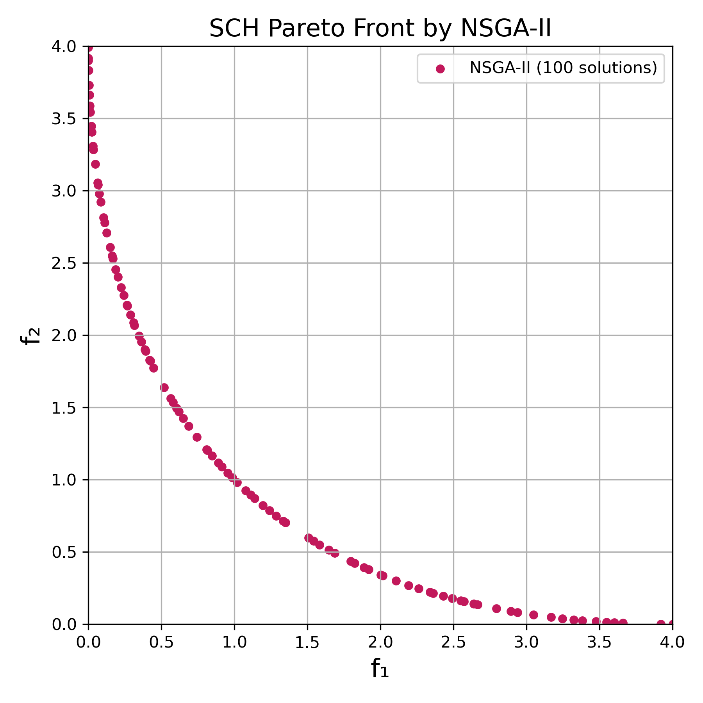

# NSGA-II Implementation for Bi-objective Optimization

## ( I ) Introduction

- **Programming language:** C++
- **Metaheuristic algorithm:**  
  NSGA-II (Fast Elitist Multiobjective Genetic Algorithm)  
- **Benchmark functions:**  
  Bi-objective combination of Sphere and Shifted Sphere  
  (f1: ∑xᵢ², f2: ∑(xᵢ−2)²)
- **Visualization:** Python (matplotlib)  
- **Configurable parameters:** run, dimension, population size, function ID, crossover rate (CR), mutation rate (MR)

### PseudoCode
```text
Initialize population P with size N
Evaluate objectives f1 and f2 for each individual in P

while (nfes < mnfes):
    Perform Fast Non-Dominated Sorting on P
    Assign Crowding Distance for each front in P

    Generate offspring Q by:
        - Simulated Binary Crossover (SBX) on selected parents from P
        - Polynomial Mutation on Q

    Evaluate f1 and f2 for each individual in Q

    Combine P and Q into R = P ∪ Q
    Perform Fast Non-Dominated Sorting on R
    Assign Crowding Distance for each front in R

    Select the next generation P from R by:
        - Picking full fronts until size limit is reached
        - If a front exceeds the remaining space, select by descending crowding distance

Output final Pareto front (rank 1 individuals)
```

---

## ( II ) Main Functionality

### `NSGAII`
- `void RunALG(int run, int func_id, int mnfes, int dim, int pop_size, double CR, double MR)`  
  *Main entry point to run NSGA-II*

- `void Init()`  
  *Initialize random population within lower/upper bounds*

- `void Evaluation(vector<individual>& population)`  
  *Evaluate objective1 and objective2 via `Problem` interface*

- `void Crossover()`  
  *Simulated Binary Crossover (SBX), with configurable CR*

- `void Mutation()`  
  *Polynomial Mutation, with configurable MR*

- `void FastNonDominatedSort()`  
  *Compute all fronts based on Pareto dominance*

- `void CrowdingDistanceAssignment()`  
  *Assign crowding distance to individuals in each front*

- `void Determination()`  
  *Select new population from combined parent + offspring*

- `void nsgaii_fileoutput()`  
  *Export Pareto front objectives to `.csv` for all runs*

---

## ( III ) Input

### Command-line arguments:
```bash
NSGAII.exe {run} {func_id} {mnfes} {dim} {pop_size} {CR} {MR}
```

- `run`         : Number of independent runs (e.g., 5)  
- `func_id`     : Objective function set (default: 1 for [f1, f2])  
- `mnfes`       : Maximum number of fitness evaluations  
- `dim`         : Number of dimensions  
- `pop_size`    : Population size  
- `CR`          : Crossover rate (e.g., 0.9)  
- `MR`          : Mutation rate (e.g., 0.1)  

---

## ( IV ) Output

- `temp_results/pareto_run{r}.csv`  
  - Each CSV contains one run’s final first-front (f1, f2)

- Example content:
  ```
  f1,f2
  3.981,0.0000001
  0.003,3.999
  ...
  ```

---

## ( V ) How to Compile & Run

### 🛠 Compile
#### 方法 1：MSYS2
```bash
g++ main.cpp -o run.exe -std=c++11
```

#### 方法 2：Visual Studio
按下 `Ctrl + Shift + B`

---

### Run
```bash
./run.exe 1 1 25000 1 100 0.9 0.1
```

這會執行 1 次 NSGA-II，維度為 1，產生 `temp_results/pareto_run{1}.csv`

---

## ( VI ) Visualization

### 畫 Pareto Front (使用 Python)

#### Python 繪圖檔：`plot_pareto_{FunctionName}.py`
```python
import pandas as pd
import matplotlib.pyplot as plt

df = pd.read_csv("pareto_run1.csv")

plt.figure(figsize=(6, 6))
plt.xlim(0, 4)
plt.ylim(0, 4)
plt.scatter(df['f1'], df['f2'], c='#4682B4', s=20)
plt.xlabel("f₁")
plt.ylabel("f₂")
plt.title("Pareto Front")
plt.grid(True)
plt.savefig("pareto_run1.png", dpi=300)
plt.show()
```

#### 如何跑
```bash
條件: 已存在 pareto_run1.csv
python plot_pareto_{FunctionName}.py
```

你會看到：
- 結果圖片：`pareto_run1.png`
- 點的分布為 f1-f2 的 Pareto 前沿

---

## ( VII ) File Structure

```
NSGAII_BiObjective/
├── main.cpp                  ← 主函式入口
├── nsgaii.h                  ← NSGA-II 主邏輯
├── nsgaii_fileoutput.h       ← 輸出 Pareto 前沿 CSV
├── problem.h                 ← 多目標函數定義 (f1, f2)
├── nsgaii_plot
│   └── plot_pareto_{FunctionName}.py ← Python 畫圖工具
├── temp_results/            ← 每個 run 的 Pareto Front CSV
│   ├── pareto_run1.csv
│   ├── pareto_run2.csv
│   └── ...
└── README.md                ← 使用說明文件
```

---

## ( VIII ) Experimental Result

<p align="center">
  
</p>

---
## ( IX ) Observations
- NSGA-II 成功產生平衡分布的 Pareto 前沿，符合原論文 SCH 問題的理論最佳解分布。
- 前沿族群的個體數量隨參數（如人口大小、迭代次數）而變化，但分布穩定。

---
## ( X ) Key Features
- 非支配排序 (Non-dominated Sorting)：實作基於 fast-non-dominated-sort 的 rank 分層機制。
- 擁擠距離 (Crowding Distance)：用於維持解的多樣性，並作為前沿層內選擇依據。
- 自定義目標函數 (Objective Function)：支援多目標測試問題（如 SCH）。
- 結果輸出模組化 (Modular Output)：nsgaii_fileoutput.h 輸出 f₁, f₂ 到 pareto_run*.csv，方便視覺化。
- Python 繪圖支援：提供 plot_pareto.py 腳本，自動讀取 .csv 並生成高解析度前沿分布圖。
---

## ( XI ) References

NSGA-II:   
[K. Deb, A. Pratap, S. Agarwal, and T. Meyarivan, "A fast and elitist multiobjective genetic algorithm: NSGA-II," _IEEE Transactions on Evolutionary Computation_, vol. 6, no. 2, pp. 182-197, 2002.](http://ieeexplore.ieee.org/document/996017/)